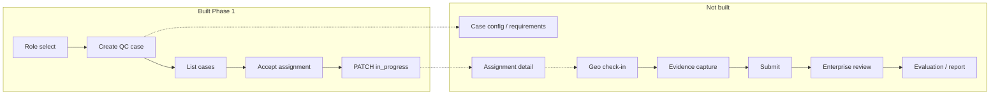
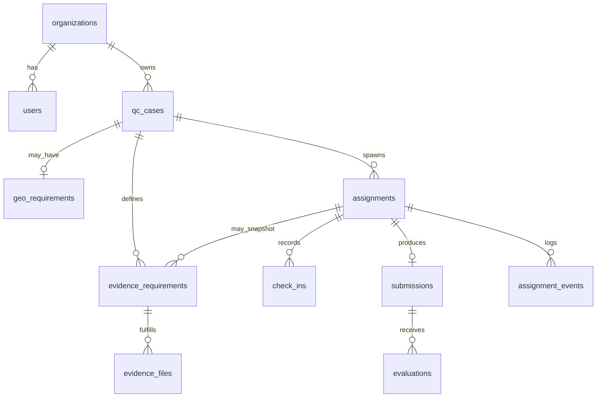

# Phase 1.5A — Product Domain Gap Analysis

| Field | Value |
|-------|-------|
| Task | Phase 1.5A — Product Domain Gap Analysis |
| Date | 2026-05-19 |
| Status | **Analysis only — no implementation** |
| Baseline | Phase 1 persistence shell (stable) |

## Purpose

Formalize what ProofLayer must become operationally, given a stable Phase 1 persistence shell and a richer hackathon demo concept (task instructions, evidence requirements, geo check-in, evidence upload, review/report) — **without copying old code or implementing yet**.

**Confirmed working (Phase 1):** `prooflayer` schema, service-role REST API, minimal UI (`/`, `/enterprise`, `/field`), browser refresh persistence, assignment accept → `in_progress` PATCH, partial unique index on assignments.

**Explicitly out of scope for this document’s implementation phase:** uploads, Gemini, geo, reports, auth/RLS.

---

## 1. Screen / Workflow Inventory

### Intended product workflow (target)

| # | Screen / step | Actor | Purpose | Phase 1 status |
|---|---------------|-------|---------|----------------|
| 1 | **Login / role selection** | All | Authenticate; route to enterprise vs field | **Stub:** `/` hard-coded links; no login |
| 2 | **Enterprise dashboard** | Enterprise | Org-level overview: open cases, in-review queue, assignment status | **Partial:** `/enterprise` = create + flat list only |
| 3 | **QC case creation** | Enterprise | Define work package (title, description, instructions, due expectations) | **Partial:** title + description only; status forced `open` |
| 4 | **Case configuration** (implicit in demo) | Enterprise | Attach evidence requirements, geo rules, priority | **Missing** |
| 5 | **Available tasks** | Field | Pool of claimable open work; hide already-assigned | **Partial:** `/field` lists `status=open` cases; no server-side exclusion |
| 6 | **Accept / claim** | Field | Create assignment; start work | **Implemented:** POST + PATCH `in_progress` |
| 7 | **Assignment detail** | Field | Instructions, checklist, due date, requirement progress | **Missing** (list shows `qc_case_id` only) |
| 8 | **Geo check-in** | Field | Prove on-site presence before/during capture | **Missing** |
| 9 | **Evidence requirements** | Both | Define what must be captured; track fulfillment | **Missing** |
| 10 | **Evidence upload** | Field | Attach photos/files per requirement | **Missing** (ADR Phase 2+) |
| 11 | **Submit for review** | Field | Package completion; move assignment/case forward | **Missing** (`submitted` exists in DB only) |
| 12 | **Review queue** | Enterprise | List submitted assignments; open detail | **Missing** |
| 13 | **Evaluation / decision** | Enterprise | Approve/reject; optional AI assist later | **Missing** |
| 14 | **Report** | Enterprise | Export/summary of proof package | **Missing** (later) |

### Current UI map

```
/                 → role selector (Enterprise | Field Worker)
/enterprise       → create QC case + list all org cases
/field            → open cases + Accept + my assignments (id + status)
```

### Workflow diagram (target vs built)



### Product gaps by screen

| Screen | Missing product elements |
|--------|--------------------------|
| Login | Real auth, session → `organization_id` + user id; logout |
| Enterprise dashboard | Filters (open / in_review / closed), assignment roll-up per case, metrics |
| QC case creation | **Task instructions** (structured, not just description), **due_at**, requirement templates, publish workflow (`draft` → `open`) |
| Available tasks | Exclude cases with active non-rejected assignment; show title not just id |
| Assignment detail | Join case instructions + requirements + progress % |
| Geo check-in | Location rule, capture timestamp/coordinates, validation |
| Evidence requirements | Types (photo count, label), mandatory flag, order |
| Evidence upload | Storage binding, mime, checksum, per-requirement linkage |
| Review flow | Submission entity, reviewer identity, approve/reject with reason |
| Report | Aggregated proof artifact (PDF/HTML) — later |

---

## 2. Entity Gap Analysis

### Current entities (Phase 1)

| Entity | Role today | Operational limit |
|--------|------------|-------------------|
| `organizations` | Tenant | No settings (timezone, branding, policies) |
| `users` | Enterprise / field_worker | No profile beyond name/email; no auth binding in app |
| `qc_cases` | Work package header | No instructions structure, location, or requirement children |
| `assignments` | Claim + status container | No submission, evidence, check-in, or event history |

### Likely future entities (extracted from demo domain)

| Proposed entity | Purpose | Suggested parent | Phase bucket |
|-----------------|---------|------------------|--------------|
| **`evidence_requirements`** | What must be captured (type, label, min count, mandatory) | `qc_case_id` (template at publish) and/or `assignment_id` (snapshot at accept) | **1.5** (schema + API, no files) |
| **`evidence_files`** | Stored artifact metadata (path, mime, size, uploader) | `evidence_requirement_id` + `assignment_id` | **2** (needs storage) |
| **`geo_requirements`** / **`location_rules`** | Required check-in radius, address/coords, enforce before submit | `qc_case_id` | **2** (needs geo capture) |
| **`check_ins`** | Actual geo events (lat/lng, accuracy, timestamp) | `assignment_id` | **2** |
| **`submissions`** | Field worker “done” package linking requirements + files | `assignment_id` | **1.5** (record only) → **2** (with files) |
| **`evaluations`** | Enterprise review outcome, notes, scores | `submission_id` or `assignment_id` | **2** (human) → **3** (+ Gemini) |
| **`assignment_events`** | Immutable status/audit trail | `assignment_id` | **1.5** (light) or **2** (full) |
| **`reports`** | Generated export of proof package | `assignment_id` or `qc_case_id` | **3+** |

### Relationship model (preliminary)



### Gap summary

| Domain concept | Where it lives today | Gap |
|----------------|---------------------|-----|
| Task instructions | `qc_cases.description` (free text) | No structured instructions, steps, or SOP versioning |
| Work checklist | — | Needs `evidence_requirements` |
| Proof artifacts | — | Needs `evidence_files` + storage |
| Location proof | — | Needs `geo_requirements` + `check_ins` |
| Completion signal | `assignments.status = submitted` (unused) | Needs `submissions` + transition rules |
| Review decision | `assignments.status = approved/rejected` (unused) | Needs `evaluations` + enterprise UI |
| Audit trail | `updated_at` only | Needs `assignment_events` |
| AI assist | — | `evaluations` extension later (Gemini) |

### Design decisions to lock in Phase 1.5A (not implement yet)

1. **Requirements at case vs assignment:** Publish requirements on `qc_case`; **snapshot** to assignment at accept so enterprise edits don’t mutate in-flight work.
2. **Single active submission per assignment** vs allow resubmit after reject — recommend one active + history via events.
3. **Case vs assignment status coupling:** When assignment → `submitted`, case → `in_review`; when approved → `closed` (or case stays `in_review` until all assignments done).

---

## 3. API Gap Analysis

### Existing endpoints

| Endpoint | Methods | Used by UI today |
|----------|---------|------------------|
| `/api/organizations` | POST | No |
| `/api/organizations/[id]` | GET | No |
| `/api/users` | GET, POST | No |
| `/api/users/[id]` | GET | No |
| `/api/qc-cases` | GET, POST | Enterprise + Field (list) |
| `/api/qc-cases/[id]` | GET, PATCH | PATCH used on field accept only |
| `/api/assignments` | GET, POST | Field |
| `/api/assignments/[id]` | GET, PATCH | Field (PATCH `in_progress` on accept) |

### Gap by workflow

| Workflow step | Exists | Missing | Suggested phase |
|---------------|--------|---------|-----------------|
| Login / session | — | Auth provider + `/api/me` or middleware | **2** (auth) |
| List org users | GET `/api/users` | UI; PATCH user | **1.5** UI only / **2** PATCH |
| Enterprise dashboard | GET qc-cases, assignments | Aggregated `/api/dashboard` or client joins | **1.5** client-side joins OK |
| Create case + instructions | POST qc-cases | `instructions` field or child requirements POST | **1.5** |
| Publish case (`draft`→`open`) | PATCH qc-cases | UI + validation (requirements present?) | **1.5** |
| Available tasks (filtered) | GET qc-cases?status=open | `?available=true` or exclude assigned server-side | **1.5** |
| Accept assignment | POST + PATCH assignments | Atomic accept endpoint (optional) | **1.5** polish |
| Assignment detail | GET assignments/[id], qc-cases/[id] | Combined `/api/assignments/[id]?include=case,requirements` | **1.5** |
| CRUD evidence requirements | — | `/api/evidence-requirements` | **1.5** |
| Geo check-in | — | `/api/check-ins` POST; GET rules | **2** |
| Evidence upload | — | `/api/evidence-files` + signed URL | **2** |
| Submit assignment | PATCH status only | POST `/api/submissions` + status transitions | **1.5** record / **2** with files |
| Review queue | GET assignments?status=submitted | Enterprise UI | **1.5** |
| Evaluate | — | POST/PATCH `/api/evaluations` | **2** |
| Assignment events | — | GET `/api/assignments/[id]/events` or append on transitions | **1.5** light / **2** full |
| Reports | — | `/api/reports` | **3+** |
| AI evaluate | — | `/api/evaluate` (Gemini) | **3+** |

### API principles to preserve

- Keep **Next.js route handlers** + service role (no Supabase in UI).
- **`organization_id` required** on all list/create paths.
- **Immutable fields** pattern: `id`, `created_at`, `created_by`, `organization_id`.
- New resources should follow same PATCH whitelist + `mapPostgresError` patterns.

---

## 4. Field Coverage Matrix

### `organizations`

| Field | DB | Required | Optional | Create POST | Update PATCH | Response | UI | Validation | System |
|-------|-----|----------|----------|-------------|--------------|----------|-----|------------|--------|
| `id` | UUID PK | — | — | — | blocked | ✓ | — | — | `gen_random_uuid()` |
| `name` | TEXT | ✓ | — | ✓ | — (no PATCH route) | ✓ | — | non-empty | — |
| `slug` | TEXT UNIQUE | ✓ | — | ✓ | — | ✓ | — | unique | — |
| `created_at` | timestamptz | — | — | — | blocked | ✓ | — | — | default now |
| `updated_at` | timestamptz | — | — | — | blocked | ✓ | — | — | trigger |

### `users`

| Field | DB | Required | Optional | Create POST | Update PATCH | Response | UI | Validation | System |
|-------|-----|----------|----------|-------------|--------------|----------|-----|------------|--------|
| `id` | UUID PK | ✓ | — | ✓ | — (no PATCH) | ✓ | — | must match future auth.users | manual |
| `organization_id` | UUID FK | ✓ | — | ✓ | blocked | ✓ | — | FK org | — |
| `email` | TEXT UNIQUE | ✓ | — | ✓ | — | ✓ | — | unique | — |
| `full_name` | TEXT | — | ✓ | ✓ | — | ✓ | — | — | — |
| `role` | TEXT CHECK | ✓ | — | ✓ | — | ✓ | — | `enterprise` \| `field_worker` | — |
| `created_at` / `updated_at` | timestamptz | — | — | — | blocked | ✓ | — | — | trigger |

### `qc_cases`

| Field | DB | Required | Optional | Create POST | Update PATCH | Response | UI today | Validation | System |
|-------|-----|----------|----------|-------------|--------------|----------|----------|------------|--------|
| `id` | UUID PK | — | — | — | blocked | ✓ | — | — | default uuid |
| `organization_id` | UUID FK | ✓ | — | ✓ | blocked | ✓ | via identity | FK | — |
| `title` | TEXT | ✓ | — | ✓ | ✓ | ✓ | form | non-empty | — |
| `description` | TEXT | — | ✓ | ✓ (null) | ✓ | ✓ | form | — | — |
| `status` | TEXT CHECK | ✓ (default draft) | — | ✓ (default draft) | ✓ | ✓ | hardcoded `open` on create | `draft`, `open`, `in_review`, `closed` | — |
| `created_by` | UUID FK | ✓ | — | ✓ | blocked | ✓ | identity | FK user | — |
| `created_at` / `updated_at` | timestamptz | — | — | — | blocked | ✓ | — | — | trigger |

**Gaps (no column yet):** `instructions` (TEXT or child table), `due_at`, `location_summary`, `published_at`, requirement count (computed).

### `assignments`

| Field | DB | Required | Optional | Create POST | Update PATCH | Response | UI today | Validation | System |
|-------|-----|----------|----------|-------------|--------------|----------|----------|------------|--------|
| `id` | UUID PK | — | — | — | blocked | ✓ | — | — | default uuid |
| `organization_id` | UUID FK | ✓ | — | ✓ | blocked | ✓ | identity | org consistency validator | — |
| `qc_case_id` | UUID FK | ✓ | — | ✓ | ✓ | ✓ | accept target | FK + validator | — |
| `assigned_to` | UUID FK | ✓ | — | ✓ | ✓ | ✓ | FIELD_WORKER_ID | FK | — |
| `assigned_by` | UUID FK | ✓ | — | ✓ | ✓ | ✓ | ENTERPRISE_USER_ID | FK | — |
| `status` | TEXT CHECK | ✓ (default pending) | — | ✓ (default pending) | ✓ | ✓ | PATCH `in_progress` | 5 enum values | — |
| `due_at` | timestamptz | — | ✓ | ✓ | ✓ | ✓ | — | — | — |
| `created_at` / `updated_at` | timestamptz | — | — | — | blocked | ✓ | — | — | trigger |

**DB constraint:** `uq_assignments_case_worker` on `(qc_case_id, assigned_to)` WHERE `status NOT IN ('rejected')`.

**Gaps:** `submitted_at`, `accepted_at`, link to `submission_id`.

### Proposed: `evidence_requirements` (Phase 1.5 — schema TBD)

| Field (proposed) | Required | Notes |
|------------------|----------|-------|
| `id` | — | uuid |
| `organization_id` | ✓ | tenant scope |
| `qc_case_id` | ✓* | template at case level |
| `assignment_id` | ✓* | snapshot row; one of case or assignment |
| `kind` | ✓ | `photo`, `video`, `text`, `signature`, etc. |
| `label` | ✓ | display name |
| `instructions` | — | worker-facing text |
| `min_count` | — | default 1 |
| `is_mandatory` | ✓ | default true |
| `sort_order` | — | UI ordering |
| `status` | ✓ | `pending` / `fulfilled` / `waived` |
| `created_at` / `updated_at` | — | triggers |

### Proposed: `evidence_files` (Phase 2)

| Field (proposed) | Required | Notes |
|------------------|----------|-------|
| `id`, `organization_id`, `assignment_id`, `evidence_requirement_id` | ✓ | linkage |
| `storage_path` | ✓ | Supabase Storage key |
| `mime_type`, `byte_size`, `checksum` | — | integrity |
| `uploaded_by` | ✓ | user FK |
| `status` | ✓ | `pending` → `uploaded` → `verified` / `rejected` |
| `captured_at` | — | EXIF / client timestamp |

### Proposed: `geo_requirements` + `check_ins` (Phase 2)

| geo_requirements | check_ins |
|------------------|-----------|
| `qc_case_id`, lat/lng/radius, `address_text` | `assignment_id`, lat/lng, `accuracy_m`, `recorded_at` |

### Proposed: `submissions` (Phase 1.5 metadata / Phase 2 with files)

| Field | Notes |
|-------|-------|
| `assignment_id` UNIQUE (active) | one open submission |
| `submitted_by`, `submitted_at`, `notes` | field worker |
| `status` | `draft` / `submitted` / `withdrawn` |

### Proposed: `evaluations` (Phase 2+)

| Field | Notes |
|-------|-------|
| `submission_id`, `reviewer_id`, `decision`, `comments`, `score` | human review |
| `model_run_id`, `ai_summary` | Phase 3 Gemini — keep isolated from core flows |

### Proposed: `assignment_events` (Phase 1.5 light)

| Field | Notes |
|-------|-------|
| `assignment_id`, `event_type`, `from_status`, `to_status`, `actor_id` | prefer typed columns over JSONB per ADR-001 spirit |

---

## 5. State / Lifecycle Analysis

### `qc_cases`

| State | Meaning | Entered by | Exits to |
|-------|---------|------------|----------|
| `draft` | Enterprise composing | POST default | `open` (publish) |
| `open` | Available for field claim | PATCH / POST create | `in_review` (first submission) |
| `in_review` | Proof package under review | assignment submitted | `closed` |
| `closed` | Terminal | approve / manual close | — |

**Gap today:** UI always creates `open`; no `draft` or transition to `in_review`/`closed`.

### `assignments`

| State | Meaning | Entered by | Exits to |
|-------|---------|------------|----------|
| `pending` | Created, not started | POST | `in_progress` |
| `in_progress` | Worker active | PATCH (UI on accept) | `submitted` |
| `submitted` | Awaiting review | PATCH / submission API | `approved` / `rejected` |
| `approved` | Accepted proof | enterprise review | — |
| `rejected` | Failed review | enterprise | new assignment allowed (partial unique index excludes rejected) |

**Gap today:** Only `pending` → `in_progress` exercised; case status uncoupled.

### `evidence_requirements` (proposed)

| State | Meaning |
|-------|---------|
| `pending` | Not satisfied |
| `fulfilled` | Min evidence met |
| `waived` | Enterprise override |

### `evidence_files` (proposed)

| State | Meaning |
|-------|---------|
| `pending` | Placeholder / presign issued |
| `uploaded` | Object in storage |
| `verified` | Passed review / checksum |
| `rejected` | Failed QA |

### `evaluations` (proposed)

| State | Meaning |
|-------|---------|
| `pending` | Awaiting reviewer |
| `in_review` | Reviewer active |
| `completed` | Decision recorded |

**Optional sub-state:** `ai_pending` / `ai_complete` as columns on evaluation, not status enum pollution — keeps Gemini isolated.

### Cross-entity transition rules (to formalize in ADR-002)

1. **Accept:** assignment `in_progress`; optionally snapshot requirements.
2. **Submit:** assignment `submitted`; case `in_review`; record `submissions` row.
3. **Approve:** assignment `approved`; if no other open assignments → case `closed`.
4. **Reject:** assignment `rejected`; case may return `open` or stay `in_review` (product choice).

---

## 6. Recommended Implementation Sequencing

### Phase 1.5A (this task) — domain only

- This document + ADR-002 (future) documenting entities, lifecycles, screen map, field matrix.
- Resolve open product decisions (requirement snapshot, resubmit rules, case-assignment coupling).

### Phase 1.5B — operational shell without contamination

| Order | Deliverable | Why first | Risk if skipped |
|-------|-------------|-----------|-----------------|
| 1 | **Available-tasks API filter** | Prevents double-accept UX bug | Data integrity / worker confusion |
| 2 | **`qc_cases` instructions + publish flow** | Unblocks meaningful assignment detail | Description-only cases stay meaningless |
| 3 | **`evidence_requirements` table + CRUD API** | Checklist without storage | Upload work blocked |
| 4 | **Assignment detail UI** (case + requirements join) | Field can execute work | List-only UI unusable |
| 5 | **`submissions` row + submit transition** | Closes loop to enterprise | Stuck in `in_progress` forever |
| 6 | **Enterprise review queue UI** | PATCH approve/reject | No operational closure |
| 7 | **`assignment_events` append-only** | Audit without JSONB soup | Debugging / compliance gap |
| 8 | **Case status coupling** on submit/approve | Dashboard truth | Status drift |

**Do not add yet in 1.5:** Storage buckets, presigned URLs, geo APIs, Gemini SDK, report PDFs, RLS.

### Phase 2 — capture & proof

| Item | Depends on |
|------|------------|
| Supabase Storage + `evidence_files` | requirements |
| Upload API + UI | storage |
| `geo_requirements` + `check_ins` | assignment detail |
| Human `evaluations` | submissions |
| Auth + session-derived identity | all routes |

### Phase 3+ — intelligence & export

| Item | Notes |
|------|-------|
| Gemini evaluation | Separate service boundary; optional `evaluation_ai_runs` table |
| Reports | Read-only aggregation over submission + files + events |
| RLS | After auth model stable |

### Architectural contamination risks

| Risk | Mitigation |
|------|------------|
| Stuffing requirements into `qc_cases.description` | Child table `evidence_requirements` |
| JSONB blobs for “flexibility” | ADR-001 forbade; use typed columns or normalized rows |
| Browser Supabase client | Keep `fetch` → API only |
| Gemini in core PATCH flows | Sidecar endpoint + optional columns |
| Skipping `submissions` and only PATCH assignment | Loses proof package versioning |
| Auth later without `organization_id` in session | Design `/api/me` now in ADR even if stubbed |

---

## Summary for architect sign-off

**Phase 1** proved persistence and a **thin dispatch loop** (create case → accept → `in_progress`).

**Phase 1.5** must add **structured work definition** (instructions + requirements), **honest task pool semantics**, **assignment execution surface**, **submit/review closure**, and **event audit** — still without uploads, geo, AI, or reports.

**Phase 2+** adds **proof capture** (files, location) and **identity/security**.

The hackathon demo’s value is the **workflow graph**, not its code: enterprise defines proof obligations → field executes on-site with evidence → enterprise reviews → optional AI/reporting. This document maps that graph onto explicit entities and API boundaries while keeping the clean rebuild’s architecture intact.

---

## References

- [ADR-001](adr/001-phase1-foundation.md) — Phase 1 foundation scope
- [Phase 1 QA checklist](PHASE1_QA_CHECKLIST.md)
- Migration: `supabase/migrations/001_foundation.sql`

---

## 7. Open Decisions — Resolved by Architect (2026-05-19)

These three decisions were flagged during architect review and must be 
locked before any Phase 1.5B schema or implementation work begins.

### Decision 1 — Evidence requirement snapshot mechanism

**Decision: Option A — Copy rows at accept time.**

On assignment creation, duplicate all `evidence_requirements` rows from 
the parent `qc_case` into new rows with `assignment_id` set. Template 
rows belong to `qc_case_id` only. Working copy rows belong to 
`assignment_id` only. Evidence files always link to a requirement row 
that belongs unambiguously to one assignment.

Rejected: Option B (nullable FK join at query time) — too complex, 
harder to audit.

### Decision 2 — Resubmit behavior after rejection

**Decision: New assignment flow.**

When an assignment is rejected, the field worker must create a new 
assignment. The existing partial unique index 
`uq_assignments_case_worker` (WHERE status NOT IN ('rejected')) already 
supports this correctly — rejected assignments are excluded, allowing a 
new claim.

The `submissions` table does not need a version column. One submission 
per assignment lifecycle. A new assignment produces a new submission.

### Decision 3 — Case status on assignment rejection

**Decision: Case returns to 'open' on rejection.**

When an assignment is rejected, the parent `qc_case` transitions back 
to `open`, making it available for a new field worker to claim. This is 
consistent with Decision 2 (new assignment flow).

Transition rules:
- assignment submitted → case: open → in_review
- assignment approved → case: in_review → closed (if no other open assignments)
- assignment rejected → case: in_review → open

### Decision 4 — evidence_requirements table structure

**Decision: Two separate tables, not one table with a CHECK constraint.**

- `case_evidence_templates` — requirement definitions attached to a 
  qc_case. Enterprise creates these when configuring a case. 
  `qc_case_id` NOT NULL, `assignment_id` does not exist on this table.

- `assignment_evidence_requirements` — working copy snapshotted from 
  templates at assignment accept time. `assignment_id` NOT NULL, 
  `case_evidence_template_id` FK for traceability back to origin. 
  Evidence files link here.

Rejected: one table with nullable FKs and CHECK constraint — 
anti-pattern, creates ambiguous queries and nullable FK smell.

### Implementation gate

No Phase 1.5B schema migrations or API routes may be created until:
1. This document is committed to main.
2. ADR-002 is written and approved covering the Phase 1.5B entity 
   definitions, migration plan, and API surface.
3. Architect reviews ADR-002 before Cursor begins implementation.
